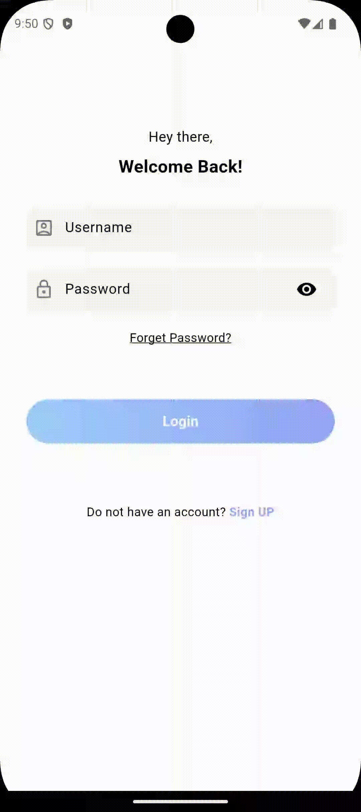

# 🏋️‍♂️ Fitness Tracker App

A **feature-rich** Flutter application designed to help users track their workouts, set fitness goals, and monitor health metrics in real-time. Integrated with **Google Fit API** and **Firebase**, this app provides a seamless experience for fitness enthusiasts.

---

## 🎥 Demo Screenshots

<div align="center">
   &nbsp;&nbsp;&nbsp;&nbsp;
   &nbsp;&nbsp;&nbsp;&nbsp;
  
  <br><br>
   &nbsp;&nbsp;&nbsp;&nbsp;
   &nbsp;&nbsp;&nbsp;&nbsp;
  
</div>

---

## 🚀 Features

### **Core Pages**

1. **Splash Page**

   - Animated logo with a smooth transition to the login page.
   - Enhances user experience with a polished first impression.

2. **Login Page**

   - Firebase Authentication for **secure user login**.
   - "Forgot Password" functionality for easy account recovery.

3. **Sign-Up Page**

   - Users can register with **email and password**.
   - Allows users to **set fitness goals** during the sign-up process.

4. **Home Dashboard**

   - Displays **daily step count, calories burned, and active minutes**.
   - Provides an overview of **weekly progress** using visual charts.

5. **Workout Tracking Page**

   - Users can log **workout type, duration, and intensity**.
   - Real-time synchronization.

6. **Progress Visualization**

   - Graph-based analysis of **historical fitness data**.
   - Users can track improvements over time.

7. **Profile Page**
   - Users can update their **personal details and fitness goals**.
   - Change password and log out options.

---

## 📊 Health Data Integration

The app syncs with **Google Fit API** to collect real-time fitness data, including:

✅ **Calorie burn estimation**  
✅ **Workout session tracking**

Users can also manually log their workouts to ensure a **comprehensive fitness record**.

---

## 💻 Tech Stack

- **Frontend**: Flutter (Dart)
- **Backend**: Firebase
  - **Firestore** for storing user data and workout history.
  - **Firebase Authentication** for secure user login.
- **APIs**:
  - **Google Fit API** for fetching fitness and health data.
  - **Chart.js** (or other visualization libraries) for progress tracking.

---

## 🛠 How to Run the Project

1. **Clone the repository**:

   ```bash
   git clone https://github.com/KaozhiChen/fitness-tracker-app.git

   cd fitness-tracker-app
   ```

1. **Install dependencies:**:
   ```bash
   flutter pub get
   ```
1. **Run the app:**:
   ```bash
   flutter run
   ```
